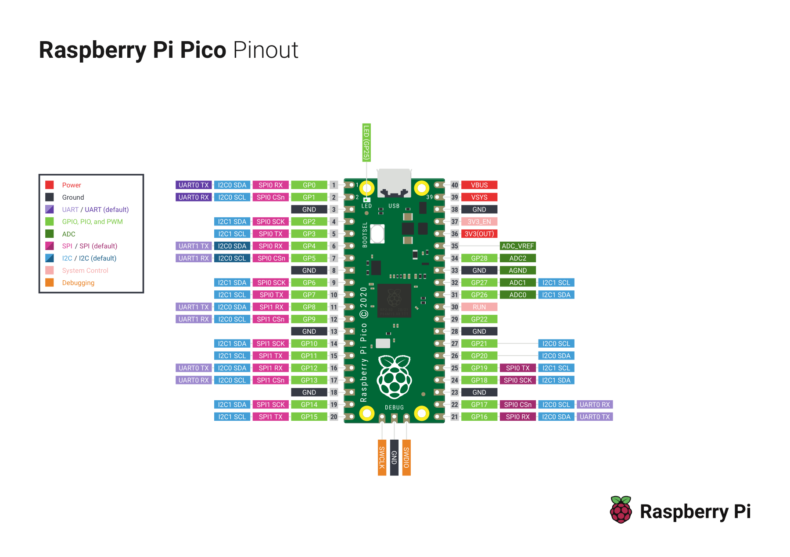

# Raspberry Pi Pico W Pinout References

## Embedded Pinout Image

Official Raspberry Pi Pico / Pico W pinout PDF:

https://datasheets.raspberrypi.com/pico/Pico-R3-A4-Pinout.pdf

Main Pico documentation page (includes pinout and related references):

https://www.raspberrypi.com/documentation/microcontrollers/pico-series.html

## Next Wiring Step

After reviewing the pinout, define the exact pin map for:

- SHT31 (I2C)
- TSL2591 (I2C)
- BMP390 (I2C or SPI)
- Micro SD adapter (SPI)
