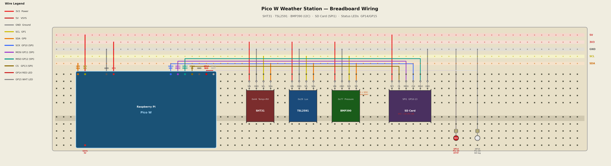

# Wiring Reference

## Wiring Diagram

## Wiring Tables

## I2C Bus (Shared by all 3 sensors)

All three sensors share a single I2C bus on the Pico W.

| Signal | Pico W Pin | GPIO | Wire Color |
|--------|-----------|------|------------|
| SDA    | Pin 1     | GP0  | Orange     |
| SCL    | Pin 2     | GP1  | Yellow     |
| 3V3    | Pin 36    | —    | Red        |
| GND    | Pin 38    | —    | Black      |

Run a dedicated row on the breadboard for each signal so all sensors tap into the same rail.

---

## SHT31 (Temperature + Humidity) — I2C address `0x44`

| SHT31 Pin | Connect to       |
|-----------|-----------------|
| VIN       | 3V3 rail        |
| GND       | GND rail        |
| SCL       | SCL rail (GP1)  |
| SDA       | SDA rail (GP0)  |

---

## TSL2591 (Light / Lux) — I2C address `0x29`

| TSL2591 Pin | Connect to       |
|-------------|-----------------|
| VIN         | 3V3 rail        |
| GND         | GND rail        |
| SCL         | SCL rail (GP1)  |
| SDA         | SDA rail (GP0)  |
| 3Vo         | Leave unconnected |
| INT         | Leave unconnected |

---

## BMP390 (Pressure + Temperature) — I2C address `0x77`

| BMP390 Pin | Connect to        | Notes                                      |
|------------|------------------|--------------------------------------------|
| VIN        | 3V3 rail         |                                            |
| GND        | GND rail         |                                            |
| SCK        | SCL rail (GP1)   | Adafruit labels clock as SCK               |
| SDI        | SDA rail (GP0)   | Adafruit labels data as SDI                |
| CS         | Leave unconnected | Floating = I2C mode. Do NOT tie to 3V3    |
| SDO        | Leave unconnected | Floating = address 0x77. Do NOT tie to 3V3 |
| 3Vo        | Leave unconnected |                                            |
| INT        | Leave unconnected |                                            |

> **Important:** Tying CS or SDO to 3V3 puts the chip in SPI mode and it will not appear on the I2C bus.

---

## SD Card Adapter (SPI) — to be wired

The SD card uses SPI, a separate bus from I2C. Suggested pin assignments:

| SD Adapter Pin | Pico W Pin | GPIO |
|---------------|-----------|------|
| VCC / 3V3     | Pin 36    | —    |
| GND           | Pin 38    | —    |
| MOSI          | Pin 5     | GP3  |
| MISO          | Pin 6     | GP4  |
| SCK           | Pin 7     | GP5  |
| CS            | Pin 9     | GP6  |

---

## I2C Address Summary

| Sensor  | Address |
|---------|---------|
| TSL2591 | `0x29`  |
| SHT31   | `0x44`  |
| BMP390  | `0x77`  |
